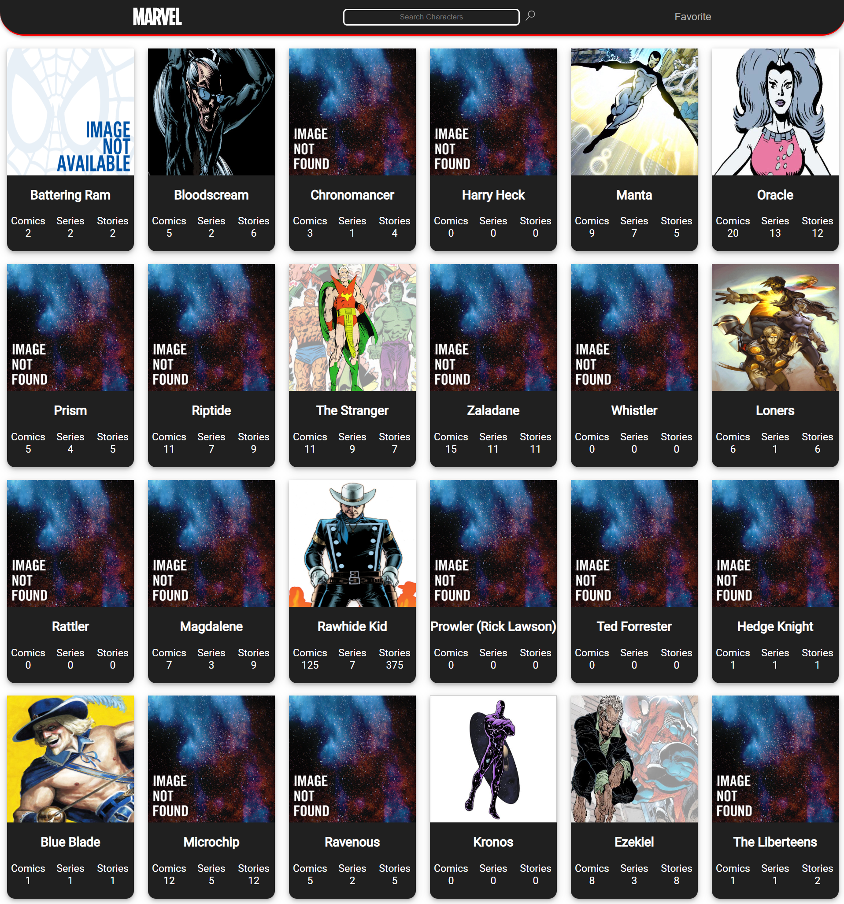

## 💻 Projeto

Aplicação para consumo da [API disponibilizado pela Marvel](https://developer.marvel.com/) é possível procurar por personagens da marvel específicos e logar.

## 📀 Como rodar

No arquivo .env no diretório raiz você deverá preencher elas com os credenciais fornecidas em [Developer Page](https://developer.marvel.com/account) no seguinte formato?

MARVEL_API_BASE_URL -> O URL que você autorizou a receber a resquisições

MARVEL_API_PUBLIC_KEY -> A chave publica disponibilizada em [My Developer Account](https://developer.marvel.com/account)

MARVEL_API_PRIVATE_KEY -> A chave privada também está em [My Developer Account](https://developer.marvel.com/account)

Agora com as variáveis de ambiente, vá no terminal e utilize 'npm install' para instalar as dependências, depois 'npm run dev' para iniciar o projeto em desenvolvimento em uma porta, com isso feito só copiar o link fornecido no terminal na na barra de navegação do browser e explorar o site!

## 🔧 Tecnologias

Foi usado nesse projeto :

- [Nextjs](https://nextjs.org/)

## Main Page

  

